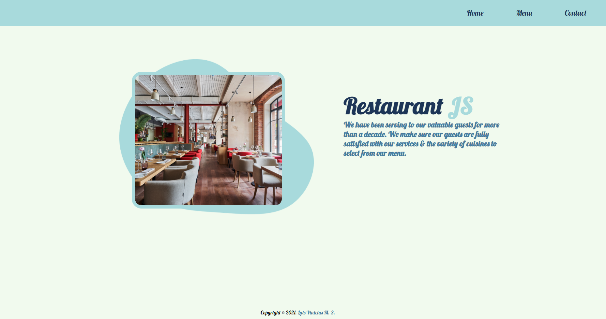

# Restaurant JS

> This simple application is a homepage for a restaurant, that includes a menu and contact page.

## Built With

- HTML
- CSS
- JavaScript
- Webpack

## Live Demo

[Live Demo Link](https://luisvinicius09.github.io/jsRestaurant/)

## Getting Started

**This is an example of how you may give instructions on setting up your project locally.**

To get a local copy up and running follow these simple example steps.

### Prerequisites

- [Node](https://nodejs.org/en/) installed.
- Code editor.
- Browser.

### Setup

- Download or clone the repository, and open the `index.html` on your browser.

### Install

- Run `npm install`, to install necessary dependencies.

### Usage

- If you want to make modifications, you can compile the files using the webpack:

- `npm build`

### Run tests

## Authors

👤 **Author1**

- GitHub: [@luisvinicius09](https://github.com/luisvinicius09)
- LinkedIn: [LinkedIn](https://www.linkedin.com/in/luis-vinicius/)

## 🤝 Contributing

Contributions, issues, and feature requests are welcome!

Feel free to check the [issues page](https://github.com/luisvinicius09/jsRestaurant/issues).

## Show your support

Give a ⭐️ if you like this project!

## Acknowledgments

- Hat tip to anyone whose code was used
- Inspiration
- etc

## 📝 Copyright

Copyright © 2021. [Luis Vinicius M. S.](https://www.linkedin.com/in/luis-vinicius/)
